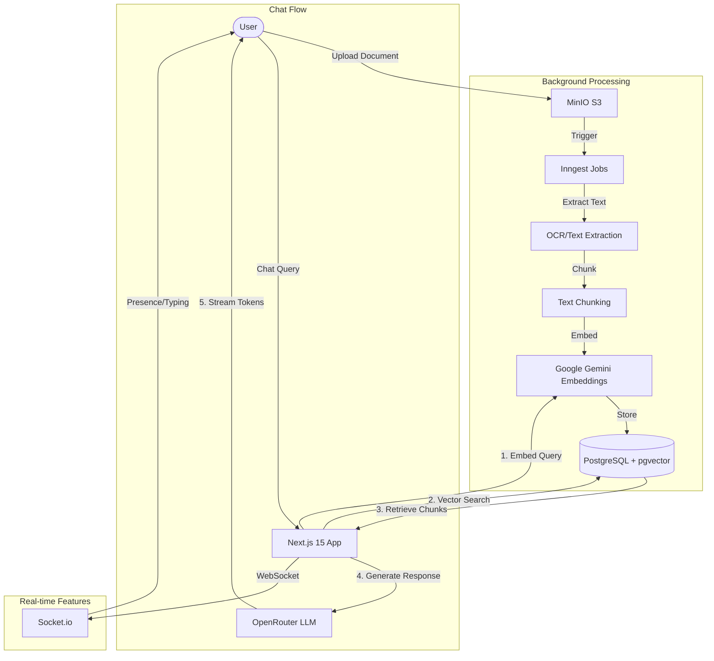

<div align="center">

# 🧠 RAG Starter Kit

**A production-ready, self-hosted RAG (Retrieval-Augmented Generation) chatbot boilerplate**

[](https://nextjs.org/)
[](https://react.dev/)
[](https://www.typescriptlang.org/)
[](https://www.postgresql.org/)
[](https://www.prisma.io/)
[](https://tailwindcss.com/)
[](https://sdk.vercel.ai/)
[](LICENSE)

[](https://github.com/rejisterjack/rag-starter-kit/actions)
[](https://github.com/rejisterjack/rag-starter-kit/actions)
[](https://github.com/rejisterjack/rag-starter-kit/actions)
[](https://github.com/rejisterjack/rag-starter-kit/actions)
[](#contributors)

[🚀 Live Demo](https://rag-starter-kit.vercel.app/) · [🐛 Report Bug](../../issues) · [✨ Request Feature](../../issues)


</div>

---

### ✨ Feature Highlights

| Feature | Description |
|---------|-------------|
| 💬 **Streaming RAG** | Real-time token generation with context |
| 📄 **Document Upload** | PDF, DOCX, TXT, Markdown support |
| 🎙️ **Voice Features** | Speech-to-text & text-to-speech |
| 👥 **Real-time Collaboration** | Multi-user workspaces with presence |
| 🌙 **Dark/Light Mode** | Beautiful themes |
| 📱 **PWA Support** | Install as native app |
| 🆓 **100% Free AI** | OpenRouter + Google Gemini |

</div>

---

## ✨ What Makes This Special

### 🆓 100% FREE AI Setup
Unlike other RAG solutions that require paid OpenAI API keys, this starter kit uses:
- **🤖 Chat**: OpenRouter free models (DeepSeek, Mistral, Llama, Gemma)
- **🔤 Embeddings**: Google Gemini free tier (1,500 req/day)
- **💰 Cost**: $0 forever for development and light usage

### 🚀 Production-Ready Features

<details open>
<summary><b>🎨 Modern UI/UX</b></summary>

- Next.js 15 App Router with React 19
- Tailwind CSS 4 with beautiful dark mode
- shadcn/ui component library
- Responsive design (mobile, tablet, desktop)
- Smooth animations with Framer Motion
- PWA support - install as native app

</details>

<details>
<summary><b>🧠 Advanced RAG Pipeline</b></summary>

- **Multi-model fallback**: Automatically switches to backup models if primary fails
- **Intelligent chunking**: Recursive text splitting with overlap
- **Hybrid search**: Vector similarity + keyword search
- **Source citations**: Every answer shows referenced documents
- **Conversation memory**: Context-aware multi-turn chats
- **Streaming responses**: Real-time token generation

</details>

<details>
<summary><b>📄 Document Processing</b></summary>

- PDF, DOCX, TXT, MD support
- Background processing with Inngest
- Automatic text extraction and chunking
- Multi-document chat context

</details>

<details>
<summary><b>🔐 Security</b></summary>

- NextAuth.js v5 with OAuth (GitHub, Google)
- Row-level database isolation
- Rate limiting with Upstash Redis
- Audit logging
- Input validation with Zod
- API key authentication

</details>

<details>
<summary><b>💬 Real-time Collaboration</b></summary>

- WebSocket/SSE for live updates
- Typing indicators
- User presence tracking
- Multi-user workspaces
- Role-based access control

</details>

<details>
<summary><b>📊 Monitoring & Analytics</b></summary>

- **Plausible Analytics** - Privacy-focused, self-hosted in Docker
- **PostHog** - Product analytics (optional)
- **Audit logging** - Security event tracking
- **Rate limiting** - Redis-based with per-endpoint config

</details>

<details>
<summary><b>🎙️ Voice Features</b></summary>

- Speech-to-text (Web Speech API + Whisper)
- Text-to-speech (browser synthesis)
- Voice activity detection
- Wake word detection ("Hey RAG")
- Voice commands

</details>

---

## 🛠️ Tech Stack

| Category | Technology |
|----------|------------|
| **Framework** | [Next.js 15](https://nextjs.org/) (App Router, RSC, Streaming) |
| **UI** | [React 19](https://react.dev/), [Tailwind CSS 4](https://tailwindcss.com/), [shadcn/ui](https://ui.shadcn.com/) |
| **AI / RAG** | [Vercel AI SDK](https://sdk.vercel.ai/), LangChain.js, OpenRouter |
| **Embeddings** | [Google Gemini](https://ai.google.dev/) (free tier) |
| **Database** | [PostgreSQL 16](https://www.postgresql.org/) + [pgvector](https://github.com/pgvector/pgvector) |
| **ORM** | [Prisma 7](https://www.prisma.io/) + `@prisma/adapter-pg` |
| **Auth** | [NextAuth.js v5](https://authjs.dev/) (Auth.js) |
| **Storage** | [MinIO](https://min.io/) (S3-compatible) / AWS S3 / Cloudflare R2 |
| **Background Jobs** | [Inngest](https://www.inngest.com/) |
| **State** | [TanStack Query](https://tanstack.com/query) + [Zustand](https://github.com/pmndrs/zustand) |
| **Testing** | [Vitest](https://vitest.dev/) + [Playwright](https://playwright.dev/) |
| **Analytics** | [Plausible](https://plausible.io/) (self-hosted) + [PostHog](https://posthog.com/) (optional) |
| **DevOps** | [Docker](https://docker.com/), [Docker Compose](https://docs.docker.com/compose/) |
| **Linting** | [Biome](https://biomejs.dev/) |

---

## 🚀 Quick Start

### Prerequisites

- **Node.js 20+** and **pnpm 9+**
- **Docker & Docker Compose** (recommended)

### Option A — Docker (Recommended, 2 minutes)

```bash
# 1. Clone repository
git clone https://github.com/rejisterjack/rag-starter-kit.git
cd rag-starter-kit

# 2. Get FREE API keys:
# - OpenRouter: https://openrouter.ai/keys
# - Google AI Studio: https://aistudio.google.com/app/apikey

# 3. Configure environment
cp .env.example .env
# Edit .env with your API keys

# 4. Start all services (PostgreSQL, Redis, MinIO, Inngest, Plausible, Next.js)
docker-compose up

# 5. Open http://localhost:3000 🎉
```

**Services started:**

| Service | URL | Notes |
|---------|-----|-------|
| Next.js app | http://localhost:3000 | Main application |
| Prisma Studio | http://localhost:5555 | Database GUI |
| Inngest Dashboard | http://localhost:8288 | Background jobs |
| MinIO Console | http://localhost:9001 | S3 storage (minioadmin/minioadmin) |
| Plausible Analytics | http://localhost:8000 | Privacy-focused analytics |

### Option B — One-Click Deploy

[](https://vercel.com/new/clone?repository-url=https://github.com/rejisterjack/rag-starter-kit)
[](https://railway.app/template/rag-starter-kit)
[](https://render.com/deploy?repo=https://github.com/rejisterjack/rag-starter-kit)

---

## 📊 Comparison with Alternatives

| Feature | RAG Starter Kit | LangChain Templates | Vercel AI SDK Templates | Custom Build |
|---------|-----------------|---------------------|------------------------|--------------|
| **Cost** | 🆓 FREE AI | Paid APIs | Paid APIs | Variable |
| **Setup Time** | 2 minutes | 30+ min | 1 hour | Days/Weeks |
| **Production Ready** | ✅ Yes | ⚠️ Partial | ⚠️ Partial | Depends |
| **Authentication** | ✅ Built-in | ❌ Manual | ❌ Manual | Manual |
| **Document Upload** | ✅ Built-in | ⚠️ Basic | ❌ No | Manual |
| **Real-time Collab** | ✅ Built-in | ❌ No | ❌ No | Manual |
| **PWA Support** | ✅ Built-in | ❌ No | ❌ No | Manual |
| **Voice Features** | ✅ Built-in | ❌ No | ❌ No | Manual |
| **Docker** | ✅ Complete | ⚠️ Partial | ❌ No | Manual |
| **TypeScript** | ✅ Strict | ⚠️ Loose | ⚠️ Loose | Depends |

---

## 🏗️ Architecture

### System Overview



### Architecture Layers

| Layer | Technology | Purpose |
|-------|------------|---------|
| **Presentation** | Next.js 15, React 19, Tailwind CSS | UI components, SSR, streaming |
| **API** | Next.js API Routes, tRPC | RESTful endpoints, type-safe APIs |
| **AI/ML** | Vercel AI SDK, OpenRouter, Gemini | LLM inference, embeddings |
| **RAG** | LangChain, custom pipeline | Document processing, retrieval |
| **Data** | PostgreSQL, pgvector, Redis | Persistent storage, caching |
| **Storage** | MinIO/S3 | Document files |
| **Queue** | Inngest | Background job processing |
| **Real-time** | Socket.io | WebSocket connections |

---

## 🔑 Environment Variables

Just **2 files**:

| File | Purpose | Git |
|------|---------|-----|
| `.env.example` | Template with all options | ✅ Tracked |
| `.env` | Your actual secrets | ❌ Ignored |

### Quick Setup

```bash
# 1. Copy the template
cp .env.example .env

# 2. Get your FREE API keys:
# - OpenRouter: https://openrouter.ai/keys
# - Google AI: https://aistudio.google.com/app/apikey

# 3. Edit .env with your keys

# 4. Start the stack
docker-compose up
```

### Required (FREE)

| Variable | Description | Get Key |
|----------|-------------|---------|
| `OPENROUTER_API_KEY` | Chat/LLM (free models) | [openrouter.ai/keys](https://openrouter.ai/keys) |
| `GOOGLE_API_KEY` | Embeddings (1,500/day free) | [aistudio.google.com](https://aistudio.google.com/app/apikey) |
| `NEXTAUTH_SECRET` | JWT signing | `openssl rand -base64 32` |

---

## 🧪 Testing

```bash
pnpm test              # Unit tests (Vitest)
pnpm test:coverage     # Coverage report
pnpm test:e2e          # E2E tests (Playwright)
pnpm test:integration  # Integration tests
```

---

## 📁 Project Structure

```
rag-starter-kit/
├── src/
│   ├── app/                 # Next.js 15 App Router
│   ├── components/          # React components (shadcn/ui)
│   ├── lib/
│   │   ├── ai/             # AI SDK config (OpenRouter + Google)
│   │   ├── db/             # Prisma 7 + pgvector
│   │   ├── rag/            # RAG pipeline (chunking, retrieval)
│   │   ├── auth/           # NextAuth.js v5
│   │   └── realtime/       # WebSocket/SSE
│   └── hooks/              # Custom React hooks
├── prisma/                 # Database schema & migrations
├── tests/                  # Unit, integration, E2E tests
├── docker-compose.*.yml    # Docker setups
└── .github/workflows/      # CI/CD pipelines
```

---

## 🤝 Contributing

Contributions welcome! See [CONTRIBUTING.md](./CONTRIBUTING.md).

```bash
# Quick start for contributors
git clone https://github.com/YOUR_USERNAME/rag-starter-kit.git
cd rag-starter-kit && pnpm install
cp .env.example .env
# Edit .env with your API keys
docker-compose up
```

See [Contributors](./CONTRIBUTORS.md) for our community!

---

## 🛡️ Security

The RAG Starter Kit implements comprehensive security measures:

### Authentication & Authorization
- **NextAuth.js v5** with OAuth (GitHub, Google) and credentials
- **SAML 2.0 SSO** support for enterprise (Okta, Azure AD)
- **API Key** authentication for programmatic access
- **RBAC** with workspace-level permissions

### Data Protection
- **Row-level security** via workspace isolation
- **TLS** for all connections
- **Secure headers** (CSP, HSTS)

### Input Validation
- **Zod schemas** for all API inputs
- **SQL injection prevention** via Prisma ORM
- **XSS protection** with React's built-in escaping

### Monitoring
- **Audit logging** for security events
- **Rate limiting** with progressive penalties

Report vulnerabilities to [security@example.com](mailto:security@example.com). See [SECURITY.md](./SECURITY.md) for details.

---

## 📝 License

Distributed under the MIT License. See [LICENSE](./LICENSE) for more information.

---

## 💡 Acknowledgements

Built with ❤️ to accelerate AI-powered application development.

- [Vercel AI SDK](https://sdk.vercel.ai/) for the amazing AI framework
- [OpenRouter](https://openrouter.ai/) for free LLM access
- [Google AI Studio](https://aistudio.google.com/) for free embeddings
- [shadcn/ui](https://ui.shadcn.com/) for beautiful components
- [Inngest](https://www.inngest.com/) for background jobs
- [pgvector](https://github.com/pgvector/pgvector) for vector search

---

## 👥 Contributors

Thanks to all the amazing people who have contributed to this project!

<!-- ALL-CONTRIBUTORS-LIST:START - Do not remove or modify this section -->
<!-- prettier-ignore-start -->
<!-- markdownlint-disable -->
<table>
  <tbody>
    <tr>
      <td align="center" valign="top" width="14.28%">
        <a href="https://github.com/rejisterjack">
          <br />
          <sub><b>Rejister Jack</b></sub>
        </a>
      </td>
      <!-- Add more contributors here -->
    </tr>
  </tbody>
</table>
<!-- markdownlint-restore -->
<!-- prettier-ignore-end -->
<!-- ALL-CONTRIBUTORS-LIST:END -->

Want to contribute? See our [Contributors Guide](./CONTRIBUTORS.md) and [Contributing Guide](./CONTRIBUTING.md)!

---

<div align="center">

**[⭐ Star this repo](https://github.com/rejisterjack/rag-starter-kit)** if you find it helpful!

Made by [Rejister Jack](https://github.com/rejisterjack) and [contributors](./CONTRIBUTORS.md) · Powered by OpenRouter + Google AI

</div>
