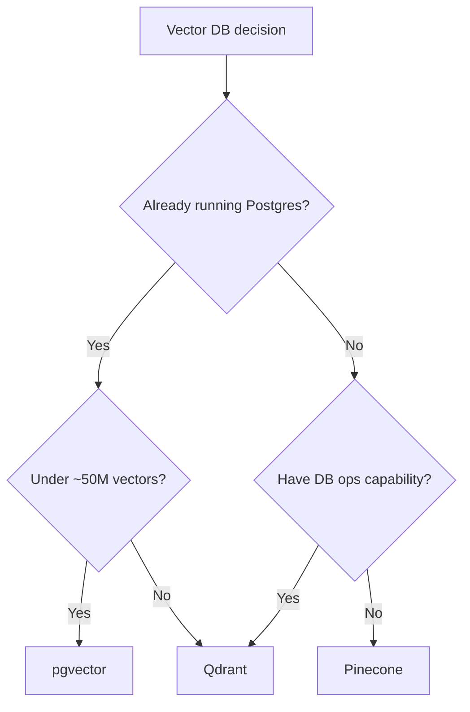

Every RAG project hits the same decision: where do the vectors live? The three most common answers are **pgvector** (PostgreSQL extension), **Qdrant** (open-source dedicated vector DB), and **Pinecone** (managed vector DB). This post compares them on the axes that actually matter for a production RAG system.

## The short version

- **Use pgvector** if you already run PostgreSQL and your vector count is under ~50 million. It removes an entire service from your architecture.
- **Use Qdrant** if you need advanced filtering, very high throughput, or want self-hosted control with a purpose-built engine.
- **Use Pinecone** if you want zero operations and are comfortable with a managed, usage-priced service.

## Comparison

| Axis | pgvector | Qdrant | Pinecone |
|---|---|---|---|
| Model | PostgreSQL extension | Dedicated open-source DB | Managed SaaS |
| Deployment | In your existing Postgres | Self-host or Qdrant Cloud | Cloud only |
| ANN index | HNSW, IVFFlat | HNSW | Proprietary |
| Hybrid search | Via SQL + tsvector | Native payload filters | Native sparse-dense |
| Filtering | Full SQL | Rich payload filters | Metadata filters |
| Transactions | ACID with your data | Separate | Separate |
| Pricing at small scale | $0 (existing DB) | $0 self-host / from ~$30/mo cloud | Free tier, then usage-based |
| Ops burden | None extra | One more service | None |
| Backups | Your Postgres backup | Separate | Managed |

## Where pgvector wins

pgvector's advantage is architectural, not benchmark-based. Your chunks, documents, users, and permissions already live in PostgreSQL. With pgvector, vectors live there too, which means:

- **One backup, one transaction boundary.** Deleting a document deletes its vectors atomically. There is no cross-service consistency window.
- **Filtering is SQL.** Workspace-scoped, role-filtered retrieval is a `WHERE` clause, not a proprietary filter DSL.
- **One fewer service.** No connection pooling for a second database, no separate monitoring, no separate deploy.

HNSW indexes keep cosine search comfortably under 50ms into the millions of vectors — beyond what most applications ever reach. The [RAG Starter Kit](https://rag.rejisterjack.com) ships this way precisely because it deletes a whole category of operational complexity.

## Where Qdrant wins

Qdrant is a genuinely excellent engine, and its payload filtering is more ergonomic than SQL for complex boolean conditions. It outperforms pgvector on raw throughput at scale, and Qdrant Cloud removes most of the ops burden. Choose it when:

- Vector count grows past roughly 50 million per collection.
- You need quantization and memory-tuning knobs beyond what pgvector exposes.
- Your team prefers a purpose-built API over SQL for retrieval.

## Where Pinecone wins

Pinecone's pitch is that nobody on your team ever thinks about the vector database. That is a real value. Choose it when:

- You have no database operations capability at all.
- Usage-based pricing aligns with your revenue.
- You want managed hybrid search and embedded rerankers out of the box.

The tradeoff is cost at scale and the fact that your retrieval layer is now external to your transaction boundary.

## Latency reality check

Benchmarks vary by hardware and payload, but honest numbers for a ~1M vector corpus, top-10 cosine search:

- **pgvector (HNSW):** 5–20ms
- **Qdrant:** 3–15ms
- **Pinecone:** 20–60ms (network hop included)

All three are far below the 1–5 seconds your LLM takes to generate. **Retrieval latency is almost never your RAG bottleneck** — generation is. Optimize your chunking and reranking before you optimize your vector store.

## Decision framework

## Takeaways

- For the overwhelming majority of RAG applications — hundreds of thousands to low millions of chunks — pgvector is the pragmatic choice and the cheapest to operate.
- Do not pick a vector database on benchmark graphs; pick on architecture fit. A second datastore costs you forever.
- Whichever you choose, retrieval latency is rarely the bottleneck. Chunking strategy and retrieval quality dominate user-perceived performance.
