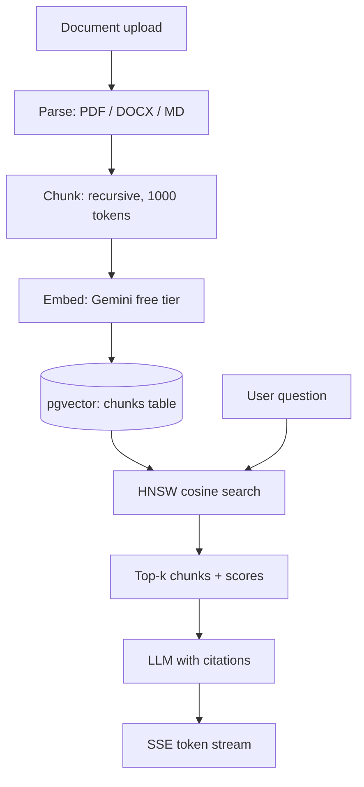

Retrieval-augmented generation (RAG) has become the default architecture for shipping AI features on private data. But most tutorials stop at a prototype: an in-memory vector store, no auth, no background processing, and nothing you would call production.

This post walks through the architecture the [RAG Starter Kit](https://rag.rejisterjack.com) uses — a TypeScript-native RAG pipeline that runs entirely on PostgreSQL with pgvector, streams responses over SSE, and deploys to Vercel in two minutes.

## Why TypeScript-native RAG

The dominant RAG tutorials are Python-first: LangChain or LlamaIndex scripts, a FastAPI wrapper, a separate vector database, and a JavaScript frontend glued on top. That is three runtimes, two languages, and a vector database bill before you write a single feature.

A TypeScript-native stack collapses this:

- **One language and one repo.** Frontend, API routes, ingestion pipeline, and vector search all live in the same Next.js application.
- **No separate vector database.** pgvector extends the PostgreSQL you already run. Chunks sit next to your relational data, in one transaction boundary.
- **One deploy target.** Vercel, Railway, or Docker — there is no second service to provision.

## The pipeline



### 1. Ingestion

Documents arrive through the UI, an API call, or a webhook. Parsing handles PDF, DOCX, TXT, and Markdown. Each document is split with a recursive character splitter — respecting code blocks and paragraph boundaries — into roughly 1,000-token chunks with overlap.

The heavy work runs in [Inngest](https://www.inngest.com) background jobs, not in the request path. Uploads return immediately; the pipeline reports progress through job status.

### 2. Embedding

Chunks are embedded with Google Gemini's free tier — 1,500 requests per day at zero cost, which covers development and light production use. Any OpenAI-compatible endpoint works as a drop-in replacement, per workspace.

Vectors land in a `Chunk` table with a native pgvector column. The critical detail: **fix your embedding dimension before your first production ingest**. The pgvector column is typed (`vector(1536)` in the starter kit), and switching providers later means re-embedding everything.

### 3. Retrieval

Vector search is a raw SQL function rather than an ORM abstraction, because ANN queries with HNSW indexes need precise control:

```sql
SELECT c.id, c.content, 1 - (c.embedding <=> $1) AS score
FROM "Chunk" c
WHERE c."workspaceId" = $2
ORDER BY c.embedding <=> $1
LIMIT $3;
```

The `<=>` operator is cosine distance; the HNSW index keeps this sub-50ms at millions of chunks. Hybrid retrieval adds a keyword (BM25-style) leg and merges results, which materially helps on exact identifiers like error codes.

### 4. Generation

Retrieved chunks are assembled into a prompt with source metadata, and the LLM streams its answer over SSE with inline citations back to the originating chunk. The Vercel AI SDK gives you one streaming contract across OpenRouter, Gemini, OpenAI, Anthropic, and Ollama.

## What "production" adds over a tutorial

The gap between demo and production is everything around the pipeline:

| Concern | Tutorial | Production |
|---|---|---|
| Auth | none | NextAuth v5, OAuth, MFA, SAML SSO |
| Multi-tenancy | single user | workspace-scoped documents and vectors |
| Background jobs | inline await | Inngest steps with retries |
| Observability | console.log | Sentry traces, PostHog funnels |
| Cost control | paid key required | free-tier providers by default |
| Evaluation | vibes | golden-dataset evals in CI |

Each row is a weekend of work on its own. The starter kit exists so you spend your weekend on your product instead.

## Getting started

```bash
git clone https://github.com/rejisterjack/rag-starter-kit.git
cd rag-starter-kit
bun install
cp .env.example .env  # DATABASE_URL + one free AI key
bun run db:migrate && bun run db:seed
bun run dev
```

Open `http://localhost:7392`, create a workspace, upload a PDF, and ask it a question. You are running the same pipeline described above — streaming, cited, and multi-tenant — on free-tier AI.

## Takeaways

- RAG does not need Python or a dedicated vector database. PostgreSQL with pgvector handles vector search at serious scale.
- Keep ingestion out of the request path; background jobs with retries are the difference between a demo and a system.
- Free-tier providers (OpenRouter for chat, Gemini for embeddings) are genuinely sufficient for development and light production.
- Citations are not optional in production. Users must be able to verify every answer against its source chunk.
