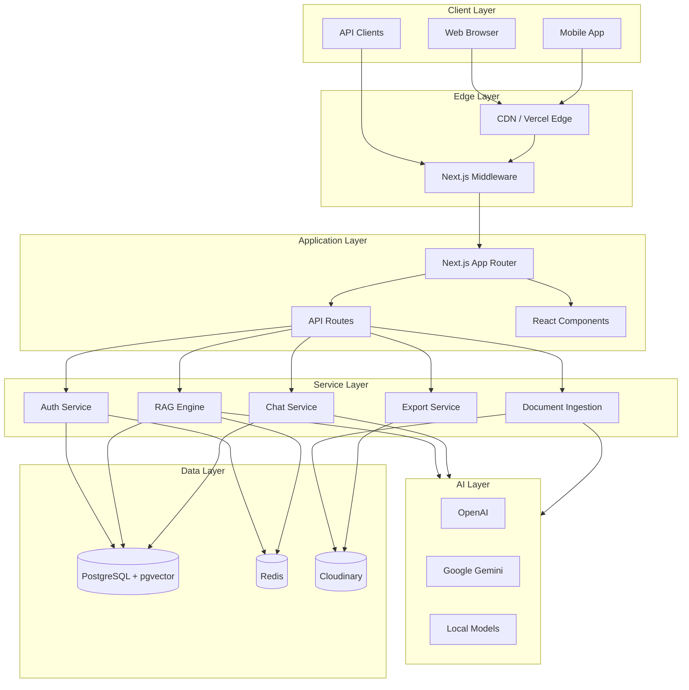
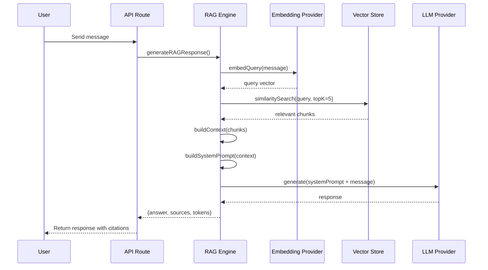
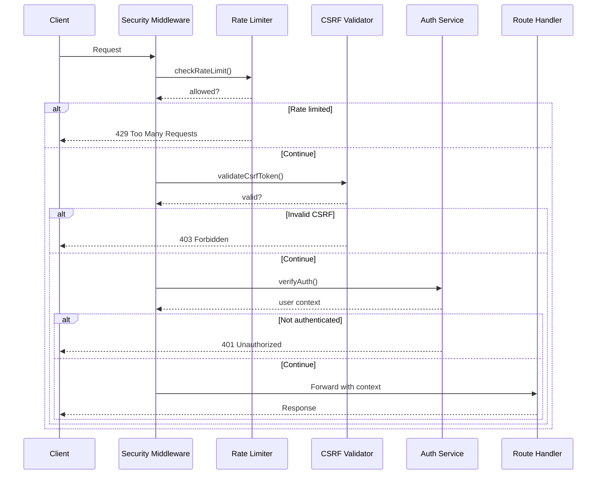
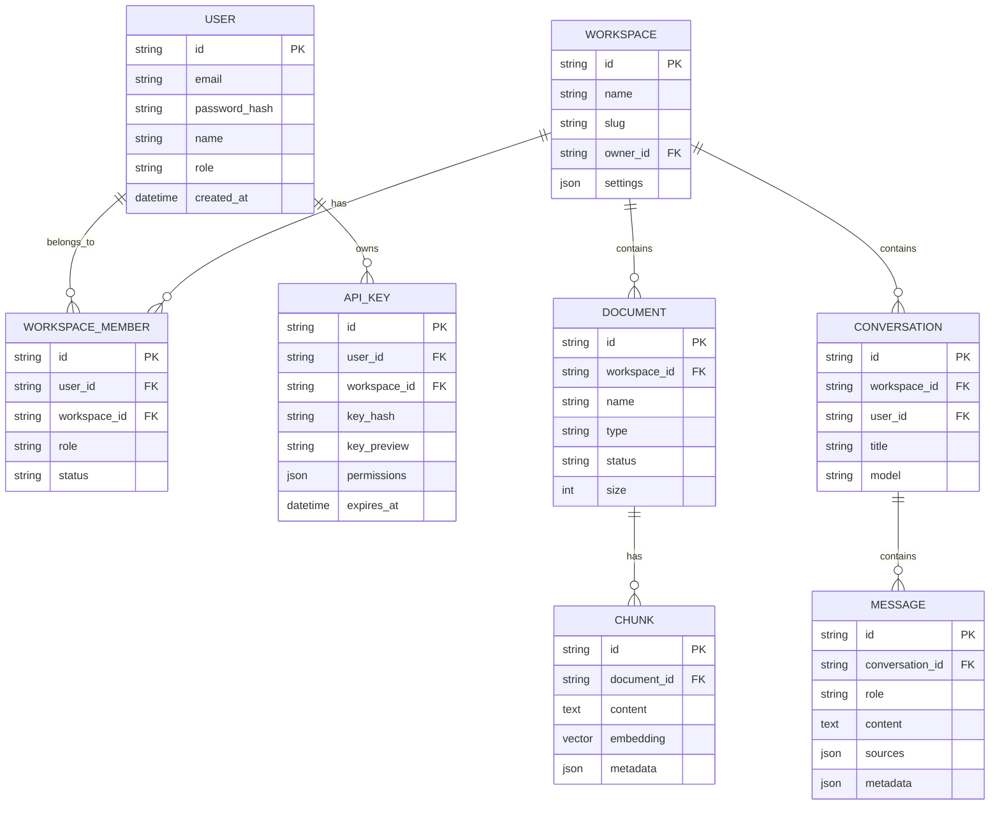
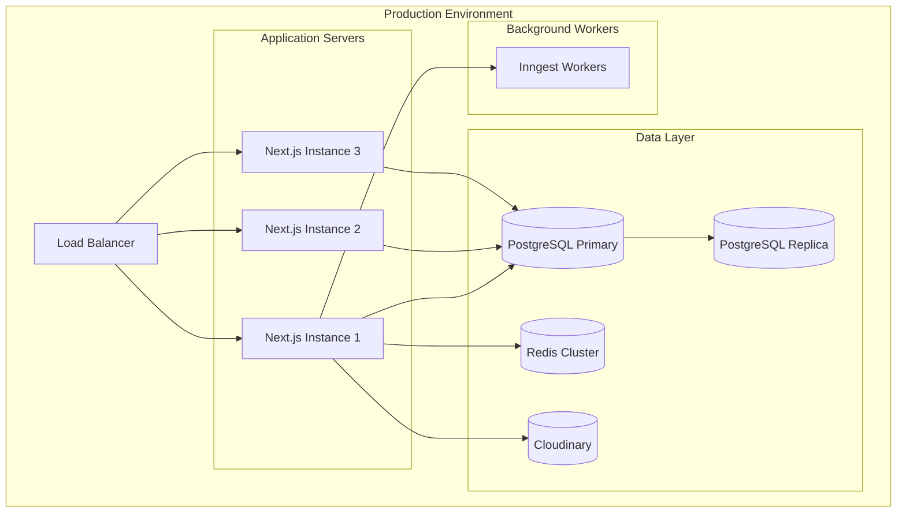
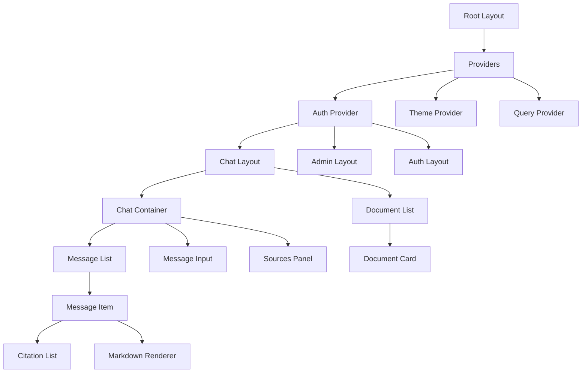

# Architecture Documentation

## System Architecture

## RAG Pipeline Architecture

## Security Flow

## Database Schema (Simplified)

## Deployment Architecture

## Component Hierarchy

## Technology Stack

| Layer | Technology |
|-------|------------|
| Frontend | Next.js 15, React 19, TypeScript |
| Styling | Tailwind CSS 4, shadcn/ui |
| State | React Query, Zustand |
| Backend | Next.js API Routes, tRPC |
| Database | PostgreSQL 16 + pgvector |
| Cache | Redis |
| Storage | Cloudinary |
| AI | Vercel AI SDK, OpenRouter |
| Auth | NextAuth v5 |
| Queue | Inngest |
| Real-time | Socket.io |
