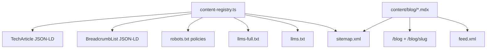
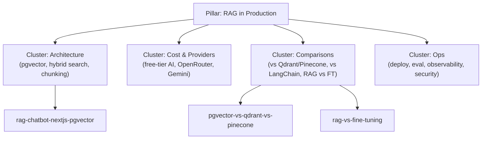

# SEO + AIO Strategy — RAG Starter Kit

> **Scope.** A dual-track strategy to maximize organic visibility in (1) traditional search engines
> (Google, Bing, DuckDuckGo) and (2) AI-driven discovery surfaces — ChatGPT Search, Perplexity,
> Gemini, Copilot, Claude — where LLMs cite and recommend products.
>
> **Status.** The technical foundation described in Phase 1–3 is implemented in this codebase.
> Phase 4+ (content cadence, off-page, authority building) is operational work.

---

## 1. Current-State Audit

### What was broken (fixed in this pass)

| # | Issue | Severity | Fix |
|---|---|---|---|
| 1 | Site metadata claimed **LangChain + Qdrant** — the app migrated to pgvector months ago. Every AI crawler and search engine was ingesting false facts. | Critical | Rewrote `seo.tsx`, `layout.tsx`, `docs/page.tsx` copy; created `SITE`/`STACK_FACTS` constants |
| 2 | No `llms.txt` / `llms-full.txt` — the primary AIO ingestion surface did not exist. | Critical | `/llms.txt` + `/llms-full.txt` routes (registry-driven) |
| 3 | No blog / content hub — zero topical-authority engine. | High | Blog infrastructure + 3 seed posts |
| 4 | Broken hreflang: query-param alternates (`/?lang=es`) are not indexable and signaled duplicate content. | High | Removed; path-based i18n documented as future work |
| 5 | Sitemap stamped `lastModified: now` on every URL at build time — freshness signal was fiction. | High | Registry-driven real dates |
| 6 | Structured data was `WebSite` only. No `FAQPage`, `BreadcrumbList`, `HowTo`, `TechArticle`, `BlogPosting`, `Organization`. | High | Full JSON-LD builder set in `seo.tsx` |
| 7 | No AI-crawler policy in robots.txt; no measurement of AI referrals or crawler hits. | High | Explicit allow-rules for 15 AI bots; PostHog events |

### What was already strong

- `force-static` rendering on all marketing/docs pages (fast, crawlable HTML).
- Dynamic sitemap + robots conventions in App Router.
- OG image route (`/og`) for social cards.
- PostHog + Vercel Analytics + SpeedInsights already wired.
- 20+ docs pages of genuinely useful content.

---

## 2. Architecture: The Content Registry

All indexable surfaces derive from **one typed registry**: `src/lib/seo/content-registry.ts`.

**Why.** Consistency across surfaces is the core AIO requirement. When a fact changes (stack,
pricing, page set), one edit propagates to sitemap, LLM ingestion files, RSS, and structured data.
Drift between what Google sees and what GPTBot sees is the most common AIO failure mode.

**Rule.** Adding a public page requires adding it to the registry. CI should enforce this (see §7).

---

## 3. Pillar 1 — Traditional SEO

### On-page

- **Title patterns.** `<Page> | RAG Starter Kit` template (root layout). Money page titles lead
  with the keyword: "RAG Starter Kit — Ship Your AI Document Chatbot This Weekend".
- **Canonicals** on every page via `generateSEO()`. No query-param self-canonicals.
- **Internal linking.** Docs hub links to all sections; blog posts cross-link to Quick Start and
  each other; pricing links to GitHub. Every blog post ends with a CTA to `/docs/getting-started/quick-start`.
- **Keyword map (own it, don't chase):**

| Page | Primary keyword | Intent |
|---|---|---|
| `/` | rag starter kit, rag boilerplate | Navigational/BOFU |
| `/blog/rag-chatbot-nextjs-pgvector` | build rag chatbot nextjs | TOFU→MOFU tutorial |
| `/blog/pgvector-vs-qdrant-vs-pinecone` | pgvector vs qdrant | Comparison/BOFU |
| `/blog/rag-vs-fine-tuning` | rag vs fine tuning | TOFU thought leadership |
| `/docs/*` | long-tail: "rag starter kit install", "pgvector rag setup" | Support/long-tail |

### Technical

- **Rendering.** All public pages `force-static`. No client-only content on indexable routes.
- **Core Web Vitals.** SpeedInsights is live; bundle analyzer available (`ANALYZE=true`). Landing
  page ships interactive components behind `Suspense` with skeletons.
- **Sitemap.** Registry-driven; real `lastModified`; hourly cache with SWR.
- **robots.txt.** Auth/admin/API disallowed; docs + blog + llms.txt explicitly allowed for every
  AI bot AND generic `*`.
- **Structured data.** `WebSite` + `Organization` (root), `SoftwareApplication` + `FAQPage`
  (home, pricing), `TechArticle` + `BreadcrumbList` (docs), `BlogPosting` (blog), `HowTo` (demo).

### Off-page

Priority order for an open-source product:

1. **GitHub as the authority engine.** Repo stars, forks, and inbound links are the strongest
   off-page signals available to a starter kit. Add GitHub topics (listed in README); keep the
   README's demo/docs links pointed at the production domain so link equity flows to the site.
2. **Awesome-lists.** Submit to `awesome-nextjs`, `awesome-generative-ai`, `awesome-llm-apps`,
   `awesome-rag` (where present), `awesome-selfhosted`. One accepted PR = one durable referring
   domain.
3. **Developer directories.** Vercel templates gallery, dev.to cross-posts (canonical to the
   blog), Product Hunt launch, HN "Show HN".
4. **Comparison content as link bait.** The pgvector-vs-Qdrant post is designed to be cited in
   other articles' vector-DB comparisons. Keep its table accurate and dated.
5. **Testimonials/backlinks from the landing page** — reciprocate mentions from projects built
   on the kit.

---

## 4. Pillar 2 — GEO / AIO (Generative Engine Optimization)

LLMs cite what they can retrieve, parse, and trust. The tactics below target each stage.

### Ingestion surfaces

- **`/llms.txt`** — markdown index: product facts, stack, quickstart, docs map, OpenAPI URL.
  This is what GPTBot/Perplexity fetch first when summarizing the product.
- **`/llms-full.txt`** — flattened full-content version for deeper ingestion.
- **`/feed.xml`** — RSS so content updates propagate to aggregators within hours.
- **Explicit robots allow-rules** for GPTBot, OAI-SearchBot, ChatGPT-User, ClaudeBot, Claude-Web,
  anthropic-ai, PerplexityBot, Perplexity-User, Google-Extended, Googlebot, Applebot-Extended,
  CCBot, Bytespider, cohere-ai, Meta-ExternalAgent. (Default-deny environments block these; being
  explicit prevents accidental exclusion.)

### Content shape that gets cited

Research on GEO (Aggarwal et al., 2024; Princeton) shows citation rates improve with:

1. **Statistics and specific numbers.** "5–20ms" beats "fast". Every post includes concrete figures.
2. **Quotable, self-contained statements.** Lead sections with declarative sentences that stand
   alone when extracted: "pgvector keeps cosine search under 50ms into the millions of vectors."
3. **Tables.** LLMs and AI Overviews disproportionately pull from comparison tables. Both the
   vector-DB and RAG-vs-fine-tuning posts lead with them.
4. **Author attribution + dates.** `TechArticle`/`BlogPosting` schema with real `datePublished` —
   recency is a retrieval-ranking factor for AI search.
5. **Entity clarity.** Consistent naming ("RAG Starter Kit") across README, site, GitHub, and
   llms.txt builds one entity rather than several competing ones.

### Freshness signals

- Real `lastModified` dates in the sitemap (not build-time).
- `dateModified` in article schema when posts are updated.
- RSS feed pings aggregators on publish.

### What NOT to do

- Do not gate docs content behind JS interaction. AI crawlers do not execute JS reliably.
- Do not block AI crawlers to "protect content" — for an open-source lead-gen product, citations
  ARE the acquisition channel.
- Do not keyword-stuff llms.txt. It is read by machines that summarize; clarity beats density.

---

## 5. Pillar 3 — Content & Topical Authority

### Cluster map

### Cadence

- **Minimum:** 2 posts/month, each mapped to a cluster in the diagram above.
- **Every post must:** answer a real query (check People Also Ask / Perplexity autosuggest), lead
  with a table or statistic, include a runnable code block, cross-link ≥2 other posts/docs.
- **Refresh cycle:** revisit comparison posts quarterly (vector-DB landscapes move fast); bump
  `dateModified` and the "last updated" line.

### Next 9 posts (priority order)

1. RAG chunking strategies compared (fixed, recursive, semantic) — with eval numbers
2. How to evaluate RAG quality (golden datasets, faithfulness/recall metrics)
3. LangChain vs Vercel AI SDK for TypeScript RAG
4. Hybrid search: BM25 + pgvector in one SQL query
5. Self-hosting RAG on Railway/Docker for $5/month
6. Multi-tenant RAG: workspace-scoped retrieval and permissions
7. Streaming SSE from Next.js route handlers (deep dive)
8. OCR ingestion pipeline: scanned PDFs to searchable chunks
9. RAG security: prompt injection via documents, and mitigations

### Structured data coverage matrix

| Surface | Schema |
|---|---|
| All pages | `WebSite`, `Organization` |
| Home, Pricing | `SoftwareApplication`, `FAQPage` |
| Docs pages | `TechArticle`, `BreadcrumbList` |
| Blog posts | `BlogPosting` |
| Demo | `HowTo` |

---

## 6. Pillar 4 — Measurement (KPIs)

### Traditional SEO

| KPI | Source | Target (6 mo) |
|---|---|---|
| Indexed pages | GSC | 100% of registry |
| Impressions, "rag starter/boilerplate" cluster | GSC | 10k/mo |
| Clicks from organic | GSC | 500/mo |
| Avg position, money keywords | GSC | Top 10 |
| LCP p75 / INP p75 / CLS p75 | SpeedInsights | <2.5s / <200ms / <0.1 |
| Referring domains | GSC/Ahrefs | +20 |
| GitHub stars (proxy for authority) | GitHub | Trend upward with content cadence |

### AIO / GEO

| KPI | Source | Target (6 mo) |
|---|---|---|
| AI referral sessions (`ai_referral_visit`) | PostHog | Present & growing; track by source |
| llms.txt / llms-full.txt fetches by crawler | Server logs (`ai_crawler_hit`) | All major bots fetching post-launch |
| Citation share: "best RAG starter kit" prompts | Manual panel (below) | Kit named in ≥1 of 5 engines |
| Branded search volume | GSC | Upward trend post-AI-mentions |

**Manual citation panel (run monthly, log results):** Ask the same 5 prompts in ChatGPT (with
search), Perplexity, Gemini, Copilot, Claude:

1. "best open source RAG starter kit"
2. "how to build a RAG chatbot with Next.js"
3. "pgvector vs qdrant vs pinecone"
4. "rag vs fine tuning when to use"
5. "free RAG boilerplate TypeScript"

Score each: cited / mentioned / absent. Track over time.

### Events implemented

- `ai_referral_visit` — PostHog, fires when a session arrives from a known AI referrer
  (chatgpt.com, perplexity.ai, gemini, copilot, claude.ai, etc.), with `ai_source` property.
- `ai_crawler_hit` — structured server log (`crawler`, `path`, `requestId`) from the proxy when
  a known AI UA hits a public route; also sets `x-ai-crawler` request header.
- `llms.txt` / `llms-full.txt` fetches — logged with byte size; correlate with `ai_crawler_hit`.

---

## 7. Roadmap

### Days 0–30 (done)

- Fix stale metadata; registry; llms.txt/-full; RSS; blog + 3 posts; full schema coverage;
  AI crawler policy; measurement events.

### Days 31–60

- Launch off-page: GitHub topics, 5 awesome-list PRs, Product Hunt, dev.to cross-posts.
- Publish posts 4–6 from the backlog.
- Set up GSC + Bing Webmaster verification (`NEXT_PUBLIC_GOOGLE_SITE_VERIFICATION` env).
- CI guard: fail build if a public route exists without a registry entry.
- Add `lastModified` automation: derive from git history in CI rather than manual dates.

### Days 61–90

- Publish posts 7–9; refresh comparison posts with `dateModified`.
- First manual citation panel run; record baseline.
- Evaluate path-based i18n (`/es/docs/...`) if non-English traffic justifies it — replacing the
  removed query-param hreflang with real localized routes.
- Review AI referral funnel in PostHog: which `ai_source` converts to GitHub stars/deploys.

---

## 8. File Map (implemented)

| Concern | File |
|---|---|
| Registry (single source of truth) | `src/lib/seo/content-registry.ts` |
| AI agent detection | `src/lib/seo/ai-agents.ts` |
| Blog content layer | `src/lib/blog.ts` |
| SEO helpers + JSON-LD builders | `src/components/seo.tsx` |
| Docs shell (breadcrumbs + TechArticle) | `src/components/docs/docs-shell.tsx` |
| Sitemap | `src/app/sitemap.ts` |
| Robots (AI policy) | `src/app/robots.ts` |
| llms.txt | `src/app/llms.txt/route.ts` |
| llms-full.txt | `src/app/llms-full.txt/route.ts` |
| RSS | `src/app/feed.xml/route.ts` |
| Blog index / post | `src/app/blog/page.tsx`, `src/app/blog/[slug]/page.tsx` |
| Posts | `content/blog/*.mdx` |
| AI referral capture | `src/components/analytics/posthog-provider.tsx` |
| Crawler logging | `src/proxy.ts` |
| Cache headers | `next.config.ts` |

---

## 9. Verification checklist (per release)

- [ ] `curl /llms.txt` — facts match current stack
- [ ] `curl /sitemap.xml` — all registry pages present, dates real
- [ ] `curl /robots.txt` — AI bots allowed on docs/blog
- [ ] Rich Results Test on `/`, `/pricing`, one docs page, one blog post
- [ ] GSC: submit updated sitemap after content changes
- [ ] PostHog: `ai_referral_visit` firing (test with a `?utm`-simulated referrer)
